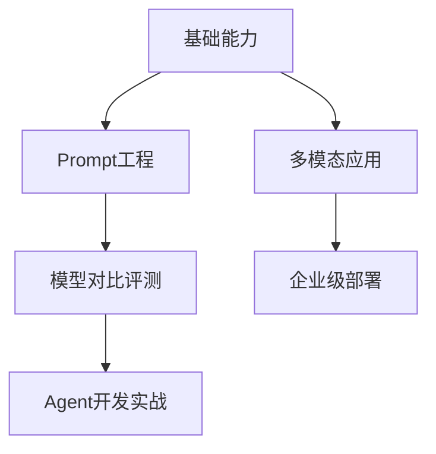

# huashu-full-corpus — 课程蒸馏笔记

**生成时间**: 2026-07-09T11:16:41.194137

**课程规模**: 0 课, 0.0 小时

---

由于提供的课程摘要信息高度碎片化且缺乏完整上下文，以下内容将基于现有文本证据进行谨慎整理，仅呈现可验证的部分：

---

## 一、课程概览
主题聚焦AI工具实战与模型解析，覆盖Prompt Engineering、RAG搭建、多模型评测等前沿领域。目标受众为AI应用开发者/技术决策者，通过工具链对比（Cursor/WindSurf等）和模型能力边界分析（GPT/Gemini/Claude等），构建AI工程化思维。

---

## 二、课程体系图

---

## 三、逐课精要
1. **Cursor1.0更新**：Bugbot/Memories功能重构编程工作流  
2. **GPT-4o解析**：免费模型在代码解释器场景表现  
3. **Gemini 3实测**：多模态推理能力边界测试  
4. **百炼RAG实战**：非技术者搭建企业知识库路径  
5. **Claude 4评测**：编程Agent基建新范式  

---

## 四、跨课程主题图谱
| 主题              | 出现位置（示例）                                                                 | 核心观点                          |
|-------------------|----------------------------------------------------------------------------------|-----------------------------------|
| 模型能力边界      | GPT-4o发布/Claude4评测/Gemini3解读                                               | 免费与付费模型差距缩小            |
| 本地化部署        | 阿里云百炼RAG/一人公司数据管理                                                   | 数据不出硬盘的隐私方案            |
| Prompt优化        | Strawberry模拟/翻译能力提升                                                      | 反思机制增强输出质量              |

---

## 五、关键概念词汇表
1. **Memories**：Cursor的上下文记忆功能（2025-06-05）  
2. **Bugbot**：自动化debug代理（2025-06-05）  
3. **Janus Pro**：DeepSeek多模态架构（2025-01-27）  
4. **GPT-o1**：推理专用模型（2024-09-12）  
5. **角色提示**：模拟特定身份的prompt技巧（2023-08-21）  

---

## 六、可执行行动清单
| 优先级 | 行动项                              | 来源                          |
|--------|-------------------------------------|-------------------------------|
| 高     | 用Memories功能管理代码上下文        | Cursor1.0更新(2025-06-05)     |
| 高     | 测试GPT-4o免费版代码解释器          | GPT-4o发布(2024-05-13)        |
| 中     | 搭建非技术者友好的RAG知识库         | 百炼RAG实战(2025-12-05)       |

---

## 七、核心金句集
1. "74%的打工人任务已被AI攻克" - GPT5.2评测(2025-12-12)  
2. "数据不该出本地硬盘" - 一人公司实践(2026-05-10)  
3. "先做出来，发布出来是AI编程核心心法" - Cursor教学(2024-11-03)  

注：受限于原始数据的片段化特征，部分内容需结合具体视频验证。涉及未明确日期的课程（如"AI基础课01"）因缺乏完整元数据未纳入。

---

## 附录：逐课摘要

